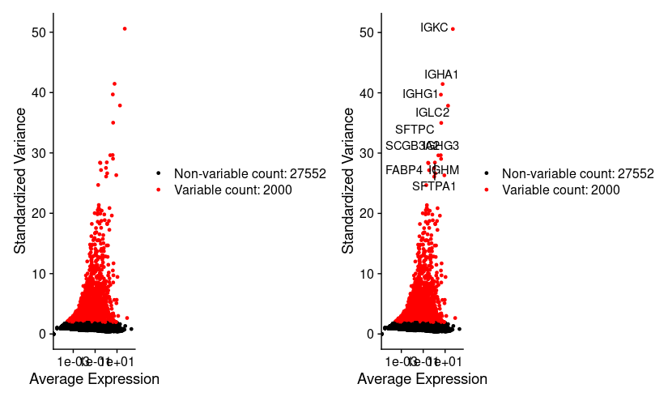
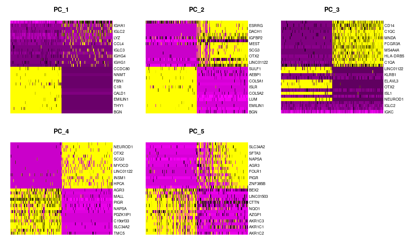

# Deciphering-Key-Genes-in-NSCLC-DTCs-leveraging-scRNAseq-data
# README

## NSCLC Single-Cell RNA-seq Analysis Pipeline

This pipeline processes and analyzes single-cell RNA sequencing (scRNA-seq) data using Seurat in R. The dataset used is a **non-small cell lung cancer (NSCLC)** sample from 10X Genomics.

## **Dependencies**

Ensure the following R packages are installed:

```r
install.packages("dplyr")
install.packages("patchwork")
install.packages("Seurat")
install.packages("viridis")
```

## **Dataset**

- **Input**: `20k_NSCLC_DTC_3p_nextgem_Multiplex_count_raw_feature_bc_matrix.h5` (Raw feature-barcode matrix from 10X Genomics)
- **Output**: CSV files for differentially expressed genes (DEGs)

## **Pipeline Steps**

### 1️⃣ **Load Data**
- Reads the raw count matrix from an `.h5` file.
- Extracts only the **gene expression** matrix.
```r
nsclc.sparse.m <- Read10X_h5(filename = "20k_NSCLC_DTC_3p_nextgem_Multiplex_count_raw_feature_bc_matrix.h5")
```

### 2️⃣ **Preprocessing & Quality Control**
- Creates a **Seurat object**.
- Filters **low-quality cells** (min 200 features, max 2500 features, mitochondrial gene content <5%).
- Visualizes **QC metrics** (`VlnPlot`, `FeatureScatter`).
```r
str(nsclc.sparse.m)

cts <- nsclc.sparse.m$`Gene Expression`

nsclc <- CreateSeuratObject(counts = cts, project = "NSCLC", min.cells = 3, min.features = 200)

View(nsclc@meta.data)

nsclc[["percent.mt"]] <- PercentageFeatureSet(nsclc, pattern = "^MT-")

VlnPlot(nsclc, features = c("nFeature_RNA", "nCount_RNA", "percent.mt"), ncol = 3)

plot1 <- FeatureScatter(nsclc, feature1 = "nCount_RNA", feature2 = "percent.mt")
plot2 <- FeatureScatter(nsclc, feature1 = "nCount_RNA", feature2 = "nFeature_RNA")
plot1 + plot2

nsclc <- subset(nsclc, subset = nFeature_RNA > 200 & nFeature_RNA < 2500 & percent.mt < 5)


```


### 3️⃣ **Normalization & Feature Selection**
- Normalizes data using **LogNormalization**.
- Identifies **highly variable genes** (top 2000 features).
- Plots **variable genes**.
```r
nsclc <- NormalizeData(nsclc, normalization.method = "LogNormalize", scale.factor = 10000)

nsclc <-  FindVariableFeatures(nsclc, selection.method = "vst", nfeatures = 2000)

top10 <- head(VariableFeatures(nsclc), 10)

plot1 <- VariableFeaturePlot(nsclc)
plot2 <- LabelPoints(plot = plot1, points = top10, repel = TRUE)
plot1 + plot2
```

### 4️⃣ **Scaling & Dimensionality Reduction**
- Scales the data.
- Runs **PCA** for linear dimensionality reduction.
- Visualizes PCA (`DimPlot`, `DimHeatmap`).
```r
all.genes <- rownames(nsclc)
nsclc <- ScaleData(nsclc, features = all.genes)
str(nsclc)

nsclc <- RunPCA(nsclc, features = VariableFeatures(object = nsclc))

print(nsclc[["pca"]], dims = 1:5, nfeatures = 5)
VizDimLoadings(nsclc, dims = 1:2, reduction = "pca")
DimPlot(nsclc, reduction = "pca") + NoLegend()
DimHeatmap(nsclc, dims = 1:5, cells = 500, balanced = TRUE)

ElbowPlot(nsclc)
```




### 5️⃣ **Clustering & UMAP Visualization**
- Finds nearest neighbors.
- Performs **clustering** (`FindClusters`).
- Runs **UMAP** for visualization (`RunUMAP`).
- Plots **UMAP clusters** (`DimPlot`).
```r
nsclc <- FindNeighbors(nsclc, dims = 1:15)
nsclc <- FindClusters(nsclc, resolution = 0.1)

head(Idents(nsclc), 5)

nsclc <- RunUMAP(nsclc, dims = 1:15)
DimPlot(nsclc, reduction = "umap")
```

### 6️⃣ **Finding Differentially Expressed Genes (DEGs)**
- Identifies cluster biomarkers (`FindAllMarkers`).
- Extracts **top 10 genes per cluster**.
- Generates **heatmaps & dot plots** (`DoHeatmap`, `DotPlot`).
```r
nsclc.markers <- FindAllMarkers(nsclc, only.pos = TRUE)
nsclc.markers %>%
  group_by(cluster) %>%
  dplyr::filter(avg_log2FC > 1) %>%
  slice_head(n = 10) %>%
  ungroup() -> topten


DoHeatmap(nsclc, features = topten$gene) + scale_fill_viridis_c()
DotPlot(nsclc, features = topten$gene) + RotatedAxis()

topten %>%
  group_by(cluster) %>%
  summarise(top_genes = paste(unique(gene), collapse = ", ")) %>%
  print(n = Inf)

```


### 7️⃣ **Marker Gene Visualization**
- Plots marker genes for **cell-type annotation** (`FeaturePlot`).
```r
DefaultAssay(nsclc) <- "RNA"
FeaturePlot(nsclc, 
            features = c("NME2", "CD3D", "MS4A1", "CD68", "MZB1", 
                         "CTTN", "IL3RA", "CPA3"),  
            min.cutoff = "q10", 
            max.cutoff = "q90", 
            cols = c("lightgrey", "blue"))
```

### 8️⃣ **Extracting Significant DEGs**
- Finds **significantly upregulated and downregulated genes** (`avg_log2FC > 2` or `< -2`).
- Saves the results as:
  - `Upregulated_nsclc_filtered.csv`
  - `Downregulated_nsclc_filtered.csv`
```r
degs <- FindAllMarkers(nsclc, only.pos = FALSE, logfc.threshold = 2, min.pct = 0.2)

upregulated_nsclc <- degs %>%
  dplyr::filter(avg_log2FC > 2, p_val_adj < 0.001, pct.1 > 0.3, pct.2 < 0.2)

downregulated_nsclc <- degs %>%
  dplyr::filter(avg_log2FC < -2, p_val_adj < 0.001, pct.1 > 0.3, pct.2 < 0.2)

write.csv(upregulated_nsclc, "Upregulated_nsclc_filtered.csv", row.names = FALSE)
write.csv(downregulated_nsclc, "Downregulated_nsclc_filtered.csv", row.names = FALSE)
```


### 10. Gene Ontology (GO) & KEGG Pathway Analysis
- Use **WebGestalt (WEB-based Gene SeT AnaLysis Toolkit)** for functional enrichment analysis.
- Identify biological processes, molecular functions, and cellular components associated with DEGs.
- Map DEGs to KEGG pathways to understand their involvement in cancer-related mechanisms.

### 11. PPI Network Construction
- Retrieve protein-protein interaction (PPI) data using the **STRING database**.
- Construct a PPI network to visualize interactions between DEGs.
- Filter interactions based on confidence scores to ensure relevance.

### 12. Hub Gene Identification
- Analyze the PPI network using **CytoHubba** in **Cytoscape**.
- Identify hub genes using **MCC (Maximal Clique Centrality) and Degree methods**.
- Compare results from both methods to prioritize key regulatory genes.

### 13. Final Key Regulatory Genes
- Identify common hub genes from both MCC and Degree method outputs.
- Highlight key regulators that play a crucial role in NSCLC DTC biology.
- Validate findings through literature review or external datasets.

## Tools & Resources
- **DEG Analysis:** Seurat2
- **GO & KEGG Analysis:** WebGestalt
- **PPI Network Construction:** STRING Database
- **Hub Gene Identification:** Cytoscape (CytoHubba Plugin)


---


## **Contact**
If you have questions, reach out! 🚀
