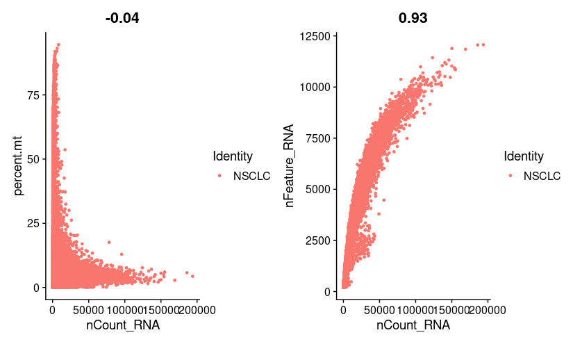
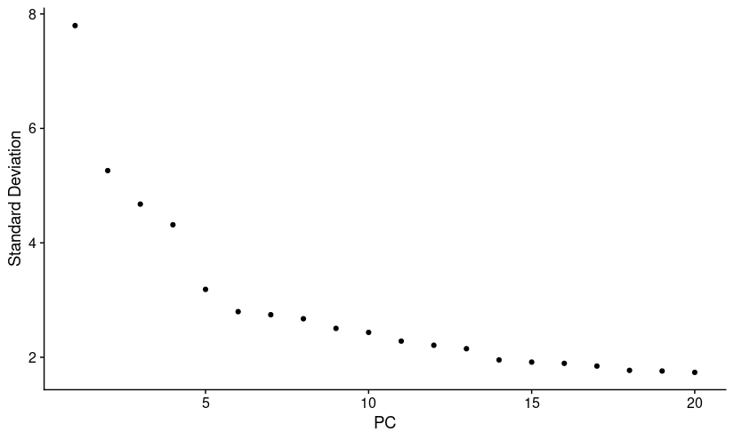
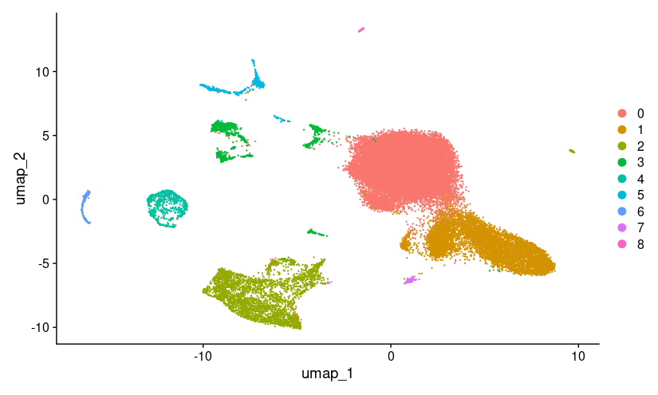
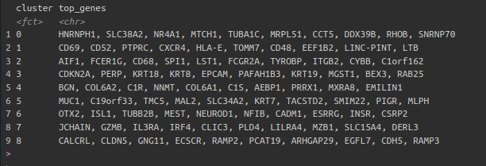
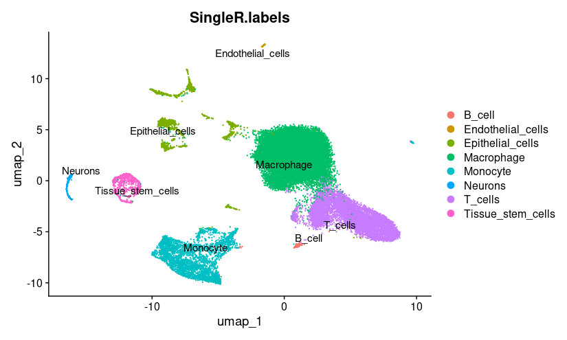

# Dissection of Migration-Linked Signaling at single cell level in NSCLC Disseminated Tumor Cells via Cell-Cell Communication and Trajectory Analysis
# README

For the investigation of key molecular features that are crucial for metastasis in disseminated tumor cells (DTCs) from non-small cell lung cancer (NSCLC), single-cell RNA sequencing data was utilized in this study. The Seurat object was subjected to rigorous quality control, normalization, scaling, and dimensionality reduction before clustering and cell-type annotation. The identified differentially expressed genes (DEGs) were then filtered based on whether they show enrichment and involvement in biological processes such as extracellular matrix organization, chemotaxis, and cell adhesion, which are vital for tumor cell migration. To gain a deeper understanding of how the DTCs interact with their microenvironment, intercellular communications were modeled by creating ligand-receptor interaction networks in CellChat. To study cell trajectories and understand changes in gene expression in different cellular states Monocle 3 was utilized. Protein-protein interaction (PPI) network was created for the filtered DEGs and hub genes were identified to underline vital genes. In a nutshell, this study enhances our understanding of key transcriptional mechanisms and signaling pathways that are vital for NSCLC metastasis.

## **Dependencies**

Ensure the following R packages are installed:

```r
install.packages("Seurat")
install.packages("ggplot2")
install.packages("celldex")
install.packages("SingleR")
install.packages("SeuratWrappers")
install.packages("SingleCellExperiment")
# For monocle3 and SeuratWrappers, also install via GitHub if needed
# remotes::install_github("cole-trapnell-lab/monocle3", force = TRUE)
# devtools::install_github("satijalab/seurat-wrappers")
# Load the libraries
library(dplyr)
library(Seurat)
library(patchwork)
library(CellChat)
library(ggplot2)
library(SingleR)
library(celldex)
library(SingleCellExperiment)
library(monocle3)
library(SeuratWrappers)
```

## **Dataset**

- **Input**: `20k_NSCLC_DTC_3p_nextgem_Multiplex_count_raw_feature_bc_matrix.h5` (Raw feature-barcode matrix from 10X Genomics)

## **Pipeline Steps**

### 1️ **Load Data**
- Reads the raw count matrix from an `.h5` file.
- Extracts only the **gene expression** matrix.
```r
nsclc.sparse.m <- Read10X_h5(filename = "20k_NSCLC_DTC_3p_nextgem_Multiplex_count_raw_feature_bc_matrix.h5")
```

### 2️ **Preprocessing & Quality Control**
- Creates a **Seurat object**.
- Filters **low-quality cells** (min 200 features, max 8000 features, mitochondrial gene content <5%).
- Visualizes **QC metrics** (`VlnPlot`, `FeatureScatter`).
```r
str(nsclc.sparse.m)

cts <- nsclc.sparse.m$`Gene Expression`

nsclc <- CreateSeuratObject(counts = cts, project = "NSCLC", min.cells = 3, min.features = 200)

View(nsclc@meta.data)

nsclc[["percent.mt"]] <- PercentageFeatureSet(nsclc, pattern = "^MT-")

VlnPlot(nsclc, features = c("nFeature_RNA", "nCount_RNA", "percent.mt"), ncol = 3)

plot1 <- FeatureScatter(nsclc, feature1 = "nCount_RNA", feature2 = "percent.mt")
plot2 <- FeatureScatter(nsclc, feature1 = "nCount_RNA", feature2 = "nFeature_RNA")
plot1 + plot2

nsclc <- subset(nsclc, subset = nFeature_RNA > 200 & nFeature_RNA < 8000 & percent.mt < 5)


```
Before Filtering.




After Filtering.


### 3️ **Normalization & Feature Selection**
- Normalizes data using **LogNormalization**.
- Identifies **highly variable genes** (top 2000 features).
- Plots **variable genes**.
```r
nsclc <- NormalizeData(nsclc, normalization.method = "LogNormalize", scale.factor = 10000)

nsclc <-  FindVariableFeatures(nsclc, selection.method = "vst", nfeatures = 2000)

top10 <- head(VariableFeatures(nsclc), 10)

plot1 <- VariableFeaturePlot(nsclc)
plot2 <- LabelPoints(plot = plot1, points = top10, repel = TRUE)
plot1 + plot2
```

### 4️ **Scaling & Dimensionality Reduction**
- Scales the data.
- Runs **PCA** for linear dimensionality reduction.
- Visualizes PCA (`DimPlot`, `DimHeatmap`).

```r
all.genes <- rownames(nsclc)
nsclc <- ScaleData(nsclc, features = all.genes)
str(nsclc)

nsclc <- RunPCA(nsclc, features = VariableFeatures(object = nsclc))

print(nsclc[["pca"]], dims = 1:5, nfeatures = 5)
VizDimLoadings(nsclc, dims = 1:2, reduction = "pca")
DimPlot(nsclc, reduction = "pca") + NoLegend()
DimHeatmap(nsclc, dims = 1:5, cells = 500, balanced = TRUE)
ElbowPlot(nsclc)
```



### 5️⃣ **Clustering & UMAP Visualization**
- Finds nearest neighbors.
- Performs **clustering** (`FindClusters`).
- Runs **UMAP** for visualization (`RunUMAP`).
- Plots **UMAP clusters** (`DimPlot`).
```r
nsclc <- FindNeighbors(nsclc, dims = 1:14)
nsclc <- FindClusters(nsclc, resolution = 0.1)

head(Idents(nsclc), 5)

nsclc <- RunUMAP(nsclc, dims = 1:14)
DimPlot(nsclc, reduction = "umap")
```

### 6️ **Finding Cluster Biomarkers**
- Identifies cluster biomarkers (`FindAllMarkers`).
- Extracts **top 10 genes per cluster**.
- Generates **dot plot** (`DotPlot`).
```r
nsclc.markers <- FindAllMarkers(nsclc, only.pos = TRUE)
nsclc.markers %>%
  group_by(cluster) %>%
  dplyr::filter(avg_log2FC > 1) %>%
  slice_head(n = 10) %>%
  ungroup() -> topten


DotPlot(nsclc, features = topten$gene) + RotatedAxis()

topten %>%
  group_by(cluster) %>%
  summarise(top_genes = paste(unique(gene), collapse = ", ")) %>%
  print(n = Inf)

```



### 7 Cell-type annotation using SingleR
- Use `HumanPrimaryCellAtlasData` as reference.
- Annotate clusters via SingleR and visualize with DimPlot.
```r
ref <- celldex::HumanPrimaryCellAtlasData()
sce <- as.SingleCellExperiment(nsclc) 
head(nsclc$seurat_clusters)
table(nsclc$seurat_clusters)  # should return cluster counts like you already got
cluster_labels <- nsclc$seurat_clusters
names(cluster_labels) <- colnames(nsclc)
pred <- SingleR(test = sce, ref = ref, labels = ref$label.main, clusters = cluster_labels)
table(pred$labels)
nsclc$SingleR.labels <- pred$labels[match(nsclc$seurat_clusters, rownames(pred))]
DimPlot(nsclc, group.by = "SingleR.labels", label = TRUE, repel = TRUE)
table(nsclc$SingleR.labels, useNA = "always")

```
- Epithelial cells detected by cell annotation were exhibiting tumor cell like gene expression profiles. Ex: EPCAM, KRT18, KRT8, KRT19, CDKN2A. These genes are represented in the figure carrying top genes per cluster.




### 8️ **Extracting Significant DEGs**
- Finds **significantly upregulated and downregulated genes** (`avg_log2FC > 2` or `< -2`).
- Saves the results as:
  - `Upregulated_nsclc_filtered.csv`
  - `Downregulated_nsclc_filtered.csv`
```r

degs <- FindAllMarkers(nsclc, only.pos = FALSE, logfc.threshold = 2, min.pct = 0.2)

upregulated_nsclc <- degs %>%
  dplyr::filter(avg_log2FC > 2, p_val_adj < 0.001, pct.1 > 0.3, pct.2 < 0.2)

downregulated_nsclc <- degs %>%
  dplyr::filter(avg_log2FC < -2, p_val_adj < 0.001, pct.1 > 0.3, pct.2 < 0.2)

write.csv(upregulated_nsclc, "Upregulated_nsclc_filtered.csv", row.names = FALSE)
write.csv(downregulated_nsclc, "Downregulated_nsclc_filtered.csv", row.names = FALSE)


```
Downregulated


Upregulated


### 9️ Cell-cell communication (CellChat)
- Create CellChat object using normalized data and SingleR labels.
- Identify overexpressed genes/interactions.
- Visualize interaction networks and signaling roles.

```r
data.input <- GetAssayData(nsclc, assay = "RNA", slot = "data")  # normalized data
meta <- nsclc@meta.data
# create a cell chat object
cellchat.nsclc <- createCellChat(object = data.input, meta = meta, group.by = "SingleR.labels")

# set the CellChatDB
CellChatDB <- CellChatDB.human  # use built-in human ligand-receptor DB
cellchat.nsclc@DB <- CellChatDB

# pre-process the data and run cellchat
# This filters your data to only retain genes involved in known signaling (ligands, receptors, co-factors etc.)
# shrinks the dataset to only what matters for communication.
# Speeds up analysis and focuses only on communication-relevant genes.
cellchat.nsclc <- subsetData(cellchat.nsclc)  # subset signaling genes
# because overexpressed genes are  more likely to be biologically meaningful in communication — like active ligands or receptors
cellchat.nsclc <- identifyOverExpressedGenes(cellchat.nsclc)
# uses the known ligand-receptor database and checks which interactions are significantly overexpressed based on gene expression
cellchat.nsclc <- identifyOverExpressedInteractions(cellchat.nsclc)
# This maps your gene-gene interactions onto the human protein-protein interaction (PPI) network for more biological context.
cellchat.nsclc <- projectData(cellchat.nsclc, PPI.human)
# calculates the actual probability of communication between cell types based on ligand-receptor expression and their specificity.
cellchat.nsclc <- computeCommunProb(cellchat.nsclc)
# This removes weak or unreliable interactions — only keeps those between cell groups with at least 10 cells each
cellchat.nsclc <- filterCommunication(cellchat.nsclc, min.cells = 10)
# group ligand-receptor pairs into signaling pathways (e.g., TGF-β, VEGF, Notch) and compute communication probabilities at the pathway level.
cellchat.nsclc <- computeCommunProbPathway(cellchat.nsclc)
# summarizes all the communication networks
cellchat.nsclc <- aggregateNet(cellchat.nsclc)

# Visualize
# overall interaction strength
groupSize <- as.numeric(table(cellchat.nsclc@idents))
netVisual_circle(cellchat.nsclc@net$count, vertex.weight = as.numeric(table(cellchat.nsclc@idents)),
                 weight.scale = T, label.edge= F, title.name = "Number of interactions")

# Overall circle plot
groupSize <- as.numeric(table(cellchat.nsclc@idents))
netVisual_circle(cellchat.nsclc@net$count, vertex.weight = groupSize, 
                 weight.scale = T, label.edge= F, title.name = "Number of interactions")

# Heatmap of interaction strength
netVisual_heatmap(cellchat.nsclc, measure = "weight")

# most active signaling pathways
cellchat.nsclc <- computeNetSimilarity(cellchat.nsclc)
str(cellchat.nsclc@netP$similarity)

)

cellchat.nsclc <- netAnalysis_computeCentrality(cellchat.nsclc)
cellchat.nsclc@netP$pathways  # List of valid signaling pathways

# outgoing and incoming pathways
netAnalysis_signalingRole_heatmap(cellchat.nsclc, pattern = "outgoing")
netAnalysis_signalingRole_heatmap(cellchat.nsclc, pattern = "incoming")

# Role of each cell type in communication
netAnalysis_signalingRole_heatmap(cellchat.nsclc)

```


### 10 Trajectory analysis (Monocle3)
- Convert Seurat object to Monocle3 CDS.
- Transfer UMAP and clustering info.
- Learn graph and order cells based on root population.
```r
# Convert Seurat object to Monocle 3 CellDataSet
cds <- as.cell_data_set(nsclc)

# Transfer UMAP coordinates from Seurat to Monocle
reducedDims(cds)$UMAP <- nsclc@reductions$umap@cell.embeddings

# Transfer cluster info from Seurat
colData(cds)$seurat_clusters <- as.character(nsclc@active.ident)

# Run cluster_cells to get partitions (Monocle requires this even if clusters exist)
cds <- cluster_cells(cds, reduction_method = "UMAP")
# ---- Step 5: Learn trajectory graph in UMAP space ----
cds <- learn_graph(cds)

#  Define root cells using SingleR labels (optional but recommended) ----
# Pick a biologically relevant root label
# Auto root selection based on tissue stem cells
cds <- order_cells(cds, root_cells = colnames(cds)[colData(cds)$SingleR.labels == "Tissue_stem_cells"])


plot_cells(cds,
           color_cells_by = "SingleR.labels",  # or the name of your label column
           label_groups_by_cluster = FALSE,
           label_leaves = TRUE,
           label_branch_points = TRUE)

```


### 11 Cluster Profiler for finding key Biological Processes in which DEGs are involved.
```r

degs <- read.csv("Upregulated_nsclc_filtered.csv")
gene_list <- degs$gene  # change this to your actual gene column name

# Run enrichment
ego <- enrichGO(
  gene         = gene_list,
  OrgDb        = org.Hs.eg.db,
  keyType      = "SYMBOL",
  ont          = "BP",  # Biological Process
  pAdjustMethod = "BH",
  pvalueCutoff  = 0.05,
  qvalueCutoff  = 0.2
)

# Load your DEG file (assuming a CSV with a 'gene' column)
go_df <- as.data.frame(ego)

# View all available processes
View(go_df)  # or head(go_df$Description)

top_processes <- go_df[order(go_df$p.adjust), ]
head(top_processes, 10)  # Top 10 most significantly enriched


# First convert geneRatio column to numeric for sorting
gene_ratio <- sapply(strsplit(go_df$GeneRatio, "/"), function(x) as.numeric(x[1]) / as.numeric(x[2]))
go_df$geneRatioNumeric <- gene_ratio

# Sort by gene ratio
top_by_ratio <- go_df[order(-go_df$geneRatioNumeric), ]
head(top_by_ratio, 10)

# Define the migration-relevant descriptions from your top 10
target_terms <- c(
  "extracellular matrix organization",
  "cell-substrate adhesion",
  "positive regulation of cell adhesion",
  "chemotaxis",
  "taxis"
)

# Get genes involved in those processes
migration_terms_df <- go_df[go_df$Description %in% target_terms, ]
genes_for_migration <- unique(unlist(strsplit(migration_terms_df$geneID, "/")))

# If you have a DEGs dataframe already loaded (with a 'gene' column)
filtered_degs <- degs[degs$gene %in% genes_for_migration, ]
# Save the filtered DEGs to a CSV file
write.csv(filtered_degs, file = "migration_related_DEGs.csv", row.names = FALSE)

```


### 11. PPI Network Construction
- Retrieve protein-protein interaction (PPI) data using the **STRING database**.
- Construct a PPI network to visualize interactions between DEGs.
  

### 12 Hub Gene Identification
- Analyze the PPI network using **CytoHubba** in **Cytoscape**.
- Identify hub genes using **MCC (Maximal Clique Centrality) .


## Tools & Resources

- **PPI Network Construction:** STRING Database
- **Hub Gene Identification:** Cytoscape (CytoHubba Plugin)


---


## **Contact**
If you have questions, reach out! 🚀
